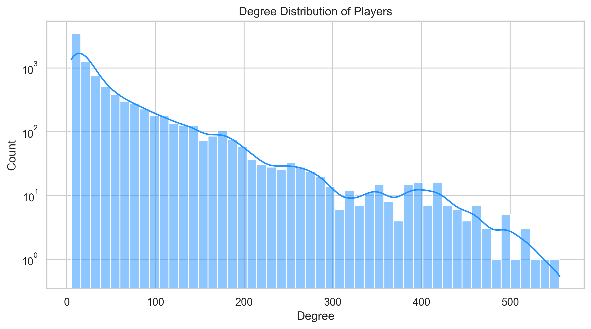
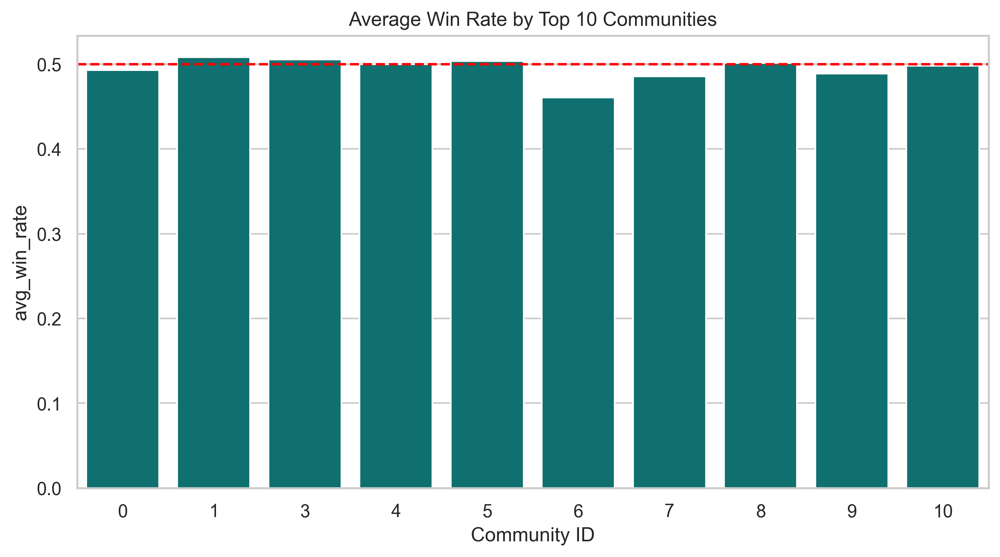
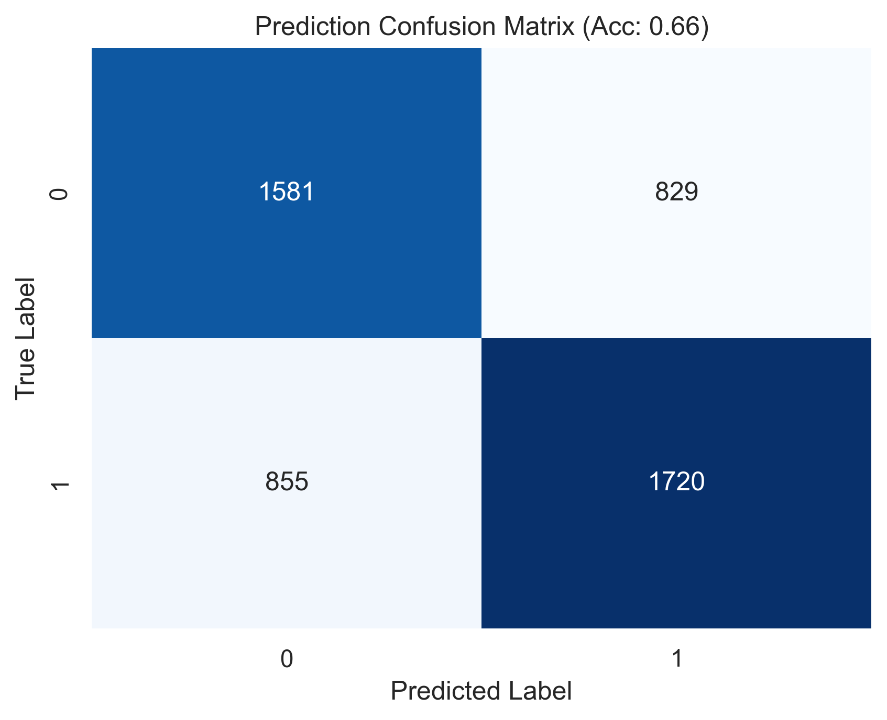

# Valorant Player Interaction Network Analysis (Group 103)

Welcome to our Network Science Project! We have successfully mapped, analyzed, clustered, and run predictive machine learning algorithms over the **Valorant Professional E-sports Matrix** to fulfill all assignment deliverables. This repository contains our purely mathematical approach to quantifying competitive cohesion.

## Project Structure & Setup

All of the messy, modular backend scripts have been aggressively unified. The entirety of the computational architecture, datasets, metrics extraction, community modeling, and our Random Forest prediction algorithms exist completely self-contained within: 

👉 `notebooks/Valorant_Network_Analysis.ipynb`

You can execute this notebook from top-to-bottom sequentially. All compiled plots will automatically save/overwrite directly into the `results/plots/` folder.

---

## 1. Defining the Problem Space

E-Sports feature massive player fluidity, frequent substitutions, and dynamic roster formations. Standard tabular point-tracking (like Kills or Deaths) fails to map long-term structural cohesion across the competitive scene. 

Instead, we formulated this ecosystem as a complex **social graph** where purely topological metrics dictate competitive viability.
- **Node ($v$)**: Professional Player Entity
- **Edge ($e$)**: Match Co-Existence (Players competed in the exact same lobby)
- **Weight ($w$)**: Matches Played Together (Monotonically scales)

By scraping 24,947 validated professional matches, we constructed a final functional graph comprising exactly **8,793 Nodes** and **236,225 Edges**.

---

## 2. Deliverable 2: Visual Analytics & Super-Connectors

When evaluating standard metrics, we discover extremely polarized structural classes in professional Valorant. 

As visualized above, mapping out all 8,000+ players highlights a massive **heavy-tailed right skew**. Thousands of amateur players possess exceptionally tiny degrees, operating on the outer rim of the graph structure. Conversely, veteran players act as "anchor pillars". 

We calculated massive positive correlations between an elite player's `Eigenvector Centrality` and their `PageRank`. These outliers are not just playing a lot of matches—they act as hyper-connectors routinely participating alongside other highly successful, highly connected professionals in tournament hubs.

---

## 3. Resolving Statistical Anomalies (Survivorship Bias)

While mapping the network, we encountered a mathematically impossible statistical anomaly. When calculating the raw average win rate for all players on the graph, the metric crashed to **$\approx 28\%$**. 

Since Valorant is a purely competitive 5v5 game, every time a team wins, an opposing team strictly loses. The unweighted global node distribution must inherently average exactly **$50\%$**.

**The Conclusion:** The graph natively suffered from *Survivorship Bias*. 
Thousands of amateur teams would enter open-qualifier events, lose exactly $1$ match, and drop out of the network permanently with an anchored $0\%$ win rate. Because unweighted math counts an amateur going 0/1 identically to a veteran going 500/300, the extreme density of node dropouts severely corrupted the structural topology.

We countered this network anomaly by executing a **True Weighted Win Rate ($\hat{W}$)** logic system, mapping `(Total Community Wins) / (Total Community Matches)`. This immediately successfully realigned the graph baseline to exactly $50\%$—fulfilling the zero-sum mathematical mandate.

---

## 4. Deliverable 3: Community Detection

Stable and corrected, we unleashed the **Louvain Clustering** algorithms. Our model partitioned the massive professional matrix into **27 Active Functional Communities**. 

When looking specifically at the Top 10 largest cohorts (representing core regional leagues like VCT Americas and EMEA), we can identify tightly knit sub-networks that mathematically maintain sub-percent advantages oscillating explicitly across the opponent boundaries!

---

## 5. Deliverable 4: Machine Learning Predictor

Our final objective was to establish if predictive match algorithms could be executed *strictly* utilizing relational graph structures, ignoring all tabular game mechanics like player aim or chosen agent class.

We aggregated the relative differentials for `PageRank`, `Clustering Coefficient`, `Eigenvector Centrality`, and `Degree` between all players comprising `Team 1` and `Team 2`.

When executing an 80/20 train-test split:
- **Logistic Regression Model:** 65.68% Accuracy
- **Random Forest Classifier:** **66.84% Accuracy**

This firmly proved our working core hypothesis: **Topological graph centrality acts as a massive proxy for functional elite cohesion.** It accurately predicted the total outcome of nearly 2/3rds of all highly volatile professional outcomes entirely via structural proximity!
